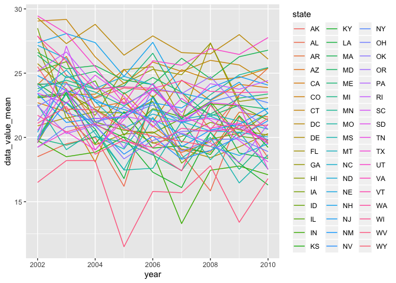
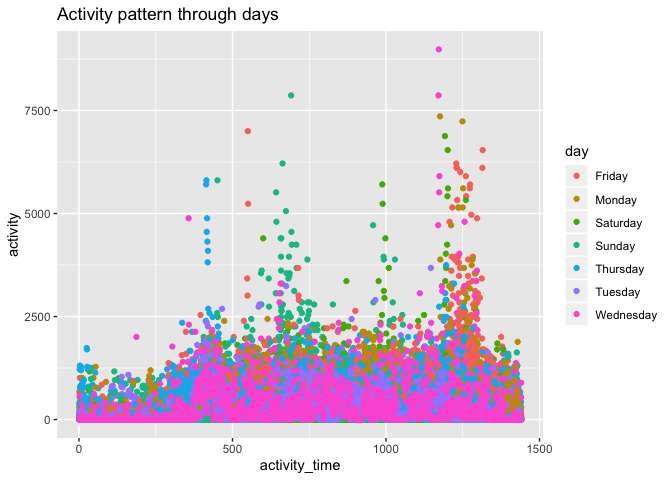

p8105\_hw3\_qz2392
================
Qimin Zhang
10/6/2019

# Problem 1

First to load the data from the p8105.datasets.

``` r
library(p8105.datasets)
data("instacart")

instacart = 
  instacart %>%
  janitor::clean_names() %>%
  distinct()
```

This dataset has 1384617 samples and 15 variables, and the key variables
include ‘order\_number, ’order\_dow’, ‘order\_hour\_of\_day’,
‘days\_since\_prior\_order’, ‘product\_name’, ‘aisle’ and
‘department’. For example, an observation like the first row,
contains an item shopped in an order with id =1, and id of the product
is 49032, it was the first item to add in cart in this order, and it was
reordered, shopped by a user with id 112108, and it was the 4th order of
this user, on the 4th day of the week at the 10th hour of the day, and
it had been 9 days since last order from this user, the product name is
‘Bulgarian Yogurt’, and it belongs to the aisle with id 120 and the
department with id 16, and the aisle name is ‘yogurt’ and the deparment
name is ‘dairy eggs’.

There are 134 aisles here, and the most items ordered from fresh
vegetables. It’s reasonable because fresh vegetables are necessary
supplies and there are many types of them.

Next to make a plot that shows the number of items ordered in each
aisle, limiting this to aisles with more than 10000 items ordered.

``` r
instacart %>%
  group_by(aisle) %>%
  mutate(
    aisle_count = length(aisle)
  ) %>%
  filter(aisle_count > 10000) %>%
  ggplot(aes(x = aisle)) +
    geom_bar() +
    theme(axis.text.x = element_text(angle = 90, hjust = 1)) +
    labs(title = "Count of aisles")
```

<!-- -->

The top 3 aisles are fresh vegetables, fresh fruits, fresh vegetables
and packaged vegetables fruits, fresh fruits, fresh vegetables.

Make a table showing the three most popular items in each of the aisles
“baking ingredients”, “dog food care”, and “packaged vegetables
fruits”. Include the number of times each item is ordered in your
table.

``` r
instacart %>%
  filter(aisle %in% c("baking ingredients", 
                    "dog food care", 
                    "packaged vegetables fruits")) %>%
  group_by(aisle, product_name) %>%
  summarise(
    product_count = length(product_name)
  ) %>%
  mutate(
    product_rank_within_aisle = order(order(product_count, decreasing = TRUE))
  ) %>%
  filter(product_rank_within_aisle <=3) %>%
  select(-product_rank_within_aisle) %>%
  knitr::kable()
```

| aisle                      | product\_name                                 | product\_count |
| :------------------------- | :-------------------------------------------- | -------------: |
| baking ingredients         | Cane Sugar                                    |            336 |
| baking ingredients         | Light Brown Sugar                             |            499 |
| baking ingredients         | Pure Baking Soda                              |            387 |
| dog food care              | Organix Chicken & Brown Rice Recipe           |             28 |
| dog food care              | Small Dog Biscuits                            |             26 |
| dog food care              | Snack Sticks Chicken & Rice Recipe Dog Treats |             30 |
| packaged vegetables fruits | Organic Baby Spinach                          |           9784 |
| packaged vegetables fruits | Organic Blueberries                           |           4966 |
| packaged vegetables fruits | Organic Raspberries                           |           5546 |

The top 3 items in the aisle ‘baking ingredients’ are ‘Cane Sugar’,
‘Light Brown Sugar’ and ‘Pure Baking Soda’. The top 3 items in the
aisle ‘dog food care’ are ‘Organix Chicken & Brown Rice Recipe’, ‘Small
Dog Biscuits’ and ‘Snack Sticks Chicken & Rice Recipe Dog Treats’. The
top 3 items in the aisle ‘packaged vegetables fruits’ are ‘Organic Baby
Spinach’, ‘Organic Blueberries’ and ‘Organic Raspberries’. We can see
that the organic food are very popular, and the Organix company is the
leader of dog food care industry.

Make a table showing the mean hour of the day at which Pink Lady Apples
and Coffee Ice Cream are ordered on each day of the week.

``` r
instacart %>%
  filter(
    product_name %in% c("Pink Lady Apples", "Coffee Ice Cream")
  ) %>%
  group_by(product_name, order_dow) %>%
  summarise(
    mean_hour_of_day = mean(order_hour_of_day)
  ) %>%
  pivot_wider(
    names_from = order_dow,
    values_from = mean_hour_of_day
  ) %>%
  knitr::kable()
```

| product\_name    |        0 |        1 |        2 |        3 |        4 |        5 |        6 |
| :--------------- | -------: | -------: | -------: | -------: | -------: | -------: | -------: |
| Coffee Ice Cream | 13.77419 | 14.31579 | 15.38095 | 15.31818 | 15.21739 | 12.26316 | 13.83333 |
| Pink Lady Apples | 13.44118 | 11.36000 | 11.70213 | 14.25000 | 11.55172 | 12.78431 | 11.93750 |

People tended to order these items around noon, so maybe it’s proper for
the sellers to push notifications about these items around noon.

# Problem 2

Load and clean the data.

``` r
data("BRFSS")
brfss = 
  brfss_smart2010 %>%
  janitor::clean_names() %>%
  distinct() %>%
  filter(topic == "Overall Health") %>%
  rename(
    state = locationabbr,
    county = locationdesc
  ) %>%
  mutate(
    response = factor(response, levels = c("Poor", "Fair", "Good", "Very good", "Excellent"))
  )
```

In 2002, which states were observed at 7 or more locations? What about
in 2010?

``` r
brfss %>%
  filter(year == 2002) %>%
  select(state, county) %>%
  distinct() %>% 
  group_by(state) %>%
  summarise(
    county_count = length(county)
  ) %>%
  filter(county_count >= 7) %>%
  knitr::kable()
```

| state | county\_count |
| :---- | ------------: |
| CT    |             7 |
| FL    |             7 |
| MA    |             8 |
| NC    |             7 |
| NJ    |             8 |
| PA    |            10 |

``` r
brfss %>%
  filter(year == 2010) %>%
  select(state, county) %>%
  distinct() %>% 
  group_by(state) %>%
  summarise(
    county_count = length(county)
  ) %>%
  filter(county_count >= 7) %>%
  knitr::kable()
```

| state | county\_count |
| :---- | ------------: |
| CA    |            12 |
| CO    |             7 |
| FL    |            41 |
| MA    |             9 |
| MD    |            12 |
| NC    |            12 |
| NE    |            10 |
| NJ    |            19 |
| NY    |             9 |
| OH    |             8 |
| PA    |             7 |
| SC    |             7 |
| TX    |            16 |
| WA    |            10 |

So in 2002, Connecticut, Florida, Massachusetts, North Carolina, New
Jersey, and Pennsylvania were observed at 7 or more locations. In 2010,
California, Colorado, Florida, Florida, Massachusetts, Maryland, North
Carolina, Nebraska, New Jersey, New York, Ohio, Pennsylvania, South
Carolina, Texas and Washington were observed at 7 or more locations.

Construct a dataset that is limited to Excellent responses, and
contains, year, state, and a variable that averages the ‘data\_value’
across locations within a state. Make a “spaghetti” plot of this average
value over time within a state.

``` r
excellent_data_value =  
  brfss %>%
  filter(response == "Excellent") %>%
  select(year, state, data_value) %>%
  group_by(year, state) %>%
  mutate(
    data_value_mean = mean(data_value, na.rm = TRUE)
  )

excellent_data_value %>%
  ggplot(aes(x = year, y = data_value_mean, group = state, color = state)) +
    geom_line()
```

<!-- --> The
mean data values of these states from 2002 to 2010 are quite fluctuate
between 10 to 30.

Make a two-panel plot showing, for the years 2006, and 2010,
distribution of data\_value for responses (“Poor” to “Excellent”) among
locations in NY State.

``` r
brfss %>%
  filter(year %in% c(2006, 2010),
         state == "NY") %>%
  select(year, state, response, data_value) %>%
  drop_na() %>% 
  ggplot(aes(x = response, y = data_value)) +
  geom_point() +
  facet_grid(.~ year)
```

<!-- -->

In 2006 and 2010, the data values are positively related to the response
levels.

# Problem 3

Load, tidy, and otherwise wrangle the data. The final dataset includes
all originally observed variables and values; has useful variable names;
includes a weekday vs weekend variable; and encode data with reasonable
variable classes.

``` r
accel = 
  read_csv("./accel_data.csv") %>%
  janitor::clean_names() %>%
  distinct() %>%
  mutate(
    weekday_or_weekend = case_when(
      (day == "Monday") | (day == "Tuesday") | (day == "Wednesday") | 
      (day == "Thursday") | (day == "Friday") ~ "weekday",
      (day == "Saturday") | (day == "Sunday") ~ "weekend"
    ),
    week = as.integer(week),
    day_id = as.integer(day_id)
  ) %>%
  select(week, day_id, day, weekday_or_weekend, everything())
```

The resulting dataset has 35 observations, and contains variables
including ‘week’ (which week was data recorded), ‘day\_id’ (mutually
different for all days), ‘day’ (which day of the week),
‘weekday\_or\_weekend’, and total 1440 activities on that day.

Using the tidied dataset, aggregate accross minutes to create a total
activity variable for each day.

``` r
accel = cbind(accel, 
              activity_total = rowSums(accel[,c(5:1444)]))
```

Create a table showing these totals.

``` r
accel %>%
  group_by(day) %>%
  summarise(
    activity_sum_by_day = sum(activity_total)
  ) %>%
  knitr::kable()
```

| day       | activity\_sum\_by\_day |
| :-------- | ---------------------: |
| Friday    |                2291711 |
| Monday    |                1858699 |
| Saturday  |                1369237 |
| Sunday    |                1919213 |
| Thursday  |                2091151 |
| Tuesday   |                1799238 |
| Wednesday |                2129772 |

The most active time was at Wednesday, Thursday and Friday.

Make a single-panel plot that shows the 24-hour activity time courses
for each day and use color to indicate day of the week.

``` r
activity_pattern =  
  accel %>%
  select(week, day, activity_1:activity_1440) %>%
  pivot_longer(
    activity_1:activity_1440,
    names_to = "activity_time",
    values_to = "activity"
  ) %>%
  mutate(
    activity_time = as.integer(str_replace_all(activity_time, "activity_", ""))
    )%>%
  ggplot(aes(x = activity_time, y = activity, color = day)) +
  geom_point() +
  labs(title = "Activity pattern through days")
activity_pattern
```

<!-- -->

``` r
ggsave("activity_pattern.jpg", activity_pattern)
```

The activities on Wednesday were relatively stable.
